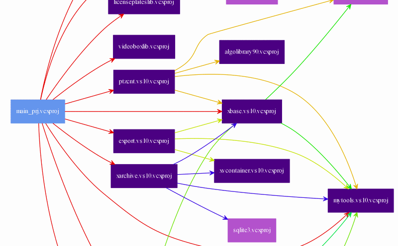

# The set of useful PowerShell scripts. #

## Project tree image generator ##



This script generates GraphViz file which is reflect the dependencies between projects in the specified Visual Studio solution file.

```
Usage: ./build_project_tree.ps1 -In test.sln -ExcludePattern "test|unit"
```

More details about the implementation process you can read [here](http://www.codeatcpp.com/2015/05/blog-post.html) (in Russian).
